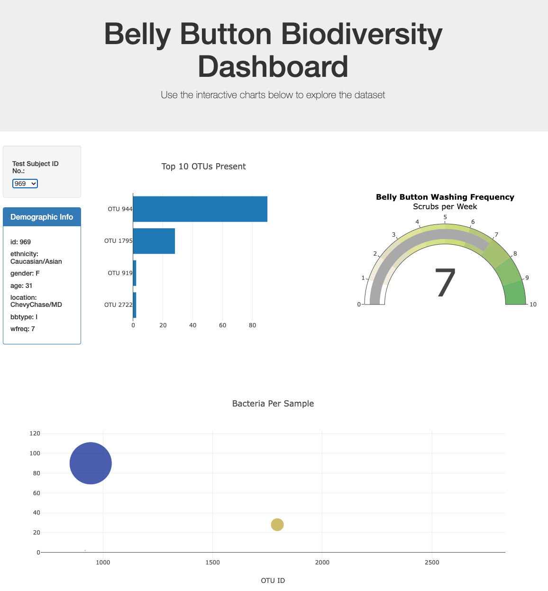

# Belly-Button

An interactive dashboard was created using Plotly and Javascript to explore the Belly Button Biodiverity dataset which catalogues the microbes that colonise human navels. 

# Background information

The dataset reveals that a small handful of microbial species (also called operational taxonomic units, or OTUs, in the study) were present in more than 70% of people, while the rest were relatively rare.

# Dashboard 

The interactive dashboard features the following:
- Drop down menu
- Bar chart
- Bubble chart
- Guage chart

# The dashboard is built with the following packages:
- JavaScript
- HTML
- Plotly.js
- D3.js
- CSS

References:

http://robdunnlab.com/projects/belly-button-biodiversity/